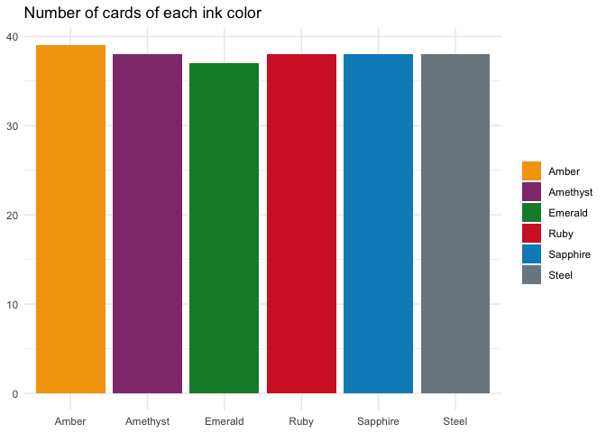
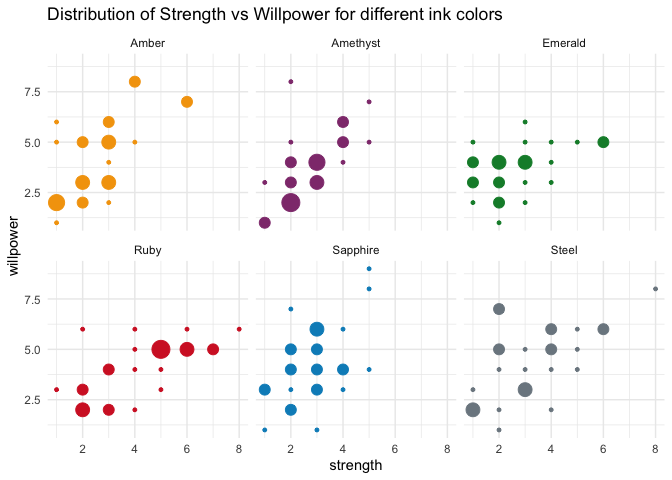

<!-- README.md is generated from README.Rmd. Please edit that file -->

# lorcanadb

<!-- badges: start -->
<!-- badges: end -->

The goal of lorcanadb is to provide information of [Lorcana TCG
cards](https://www.disneylorcana.com/en-US) in a format ready for
analysis.

## Installation

You can install the development version of lorcanadb like so:

``` r
pak::pak("emilhvitfeldt/lorcanadb")
```

## Example

``` r
library(lorcanadb)

dplyr::glimpse(cards)
#> Rows: 228
#> Columns: 18
#> $ name               <chr> "Tinker Bell", "Stitch", "Simba", "Mickey Mouse", "…
#> $ version            <chr> "Giant Fairy", "Carefree Surfer", "Returned King", …
#> $ card_type          <chr> "Character", "Character", "Character", "Character",…
#> $ classifications    <chr> "Floodborn, Ally, Fairy", "Dreamborn, Alien, Hero",…
#> $ ink_color          <chr> "Steel", "Amber", "Steel", "Amethyst", "Emerald", "…
#> $ ink_cost           <int> 6, 7, 7, 4, 7, 5, 8, 6, 8, 4, 5, 7, 6, 6, 5, 2, 3, …
#> $ inkwell            <chr> "Yes", "Yes", "Yes", "Yes", "No", "Yes", "No", "No"…
#> $ strength           <int> 4, 4, 4, 3, 6, 6, 6, 3, 4, 2, 3, 5, 2, 5, 5, 1, NA,…
#> $ willpower          <int> 5, 8, 6, 4, 5, 5, 7, 4, 6, 4, 5, 5, 7, 5, 4, 1, NA,…
#> $ keywords_abilities <chr> "Damage Shift", "Draw", "Challenger Evasive", "Redu…
#> $ lore               <int> 2, 2, 2, 2, 2, 0, 1, 2, 3, 1, 2, 2, 2, 2, 1, 1, NA,…
#> $ card_id            <chr> "216/204", "206/204", "215/204", "208/204", "210/20…
#> $ card_text          <chr> "Shift 4 (You may pay 4 to play this on top of one …
#> $ flavor_text        <chr> NA, NA, NA, NA, NA, NA, NA, NA, NA, NA, NA, "Aladdi…
#> $ set                <chr> "The First Chapter", "The First Chapter", "The Firs…
#> $ rarity             <chr> "Enchanted", "Enchanted", "Enchanted", "Enchanted",…
#> $ illustrator        <chr> "Cookie", "Milica Celikovic", "Hedvig Häggman-Sund"…
#> $ release_date       <chr> "August 18th 2023", "August 18th 2023", "August 18t…
```

The data set is in a data.frame for ease of use

``` r
library(tidyverse)

ink_colors <- c(
  Amber = "#F4A30B",
  Amethyst = "#903B7C",
  Emerald = "#0F8B36",
  Sapphire = "#008EC3",
  Ruby = "#D4252D",
  Steel = "#7C8790"
)

cards |>
  count(ink_color) |>
  ggplot(aes(ink_color, n, fill = ink_color)) +
  geom_col() +
  scale_fill_manual(values = ink_colors) +
  theme_minimal() +
  labs(
    title = "Number of cards of each ink color",
    x = NULL,
    y = NULL,
    fill = NULL
  )
```



``` r
library(tidyverse)

ink_colors <- c(
  Amber = "#F4A30B",
  Amethyst = "#903B7C",
  Emerald = "#0F8B36",
  Sapphire = "#008EC3",
  Ruby = "#D4252D",
  Steel = "#7C8790"
)

cards |>
  filter(card_type == "Character") |>
  drop_na(strength, willpower) |>
  count(strength, willpower, ink_color) |>
  ggplot(aes(strength, willpower, color = ink_color, size = n)) +
  geom_point() +
  
  scale_color_manual(values = ink_colors) +
  theme_minimal() +
  facet_wrap(~ink_color) +
  guides(size = "none", color = "none") +
  labs(title = "Distribution of Strength vs Willpower for different ink colors")
```


